# CUDA Path Tracer

**University of Pennsylvania, CIS 5650: GPU Programming and Architecture, Project 3**

- Nikita Lopatenko
- Tested on: Windows 11 Pro, Intel Core i7-13620H @ 2.40GHz, 32GB RAM, NVIDIA GeForce RTX 4070 Laptop GPU 8GB (personal laptop)

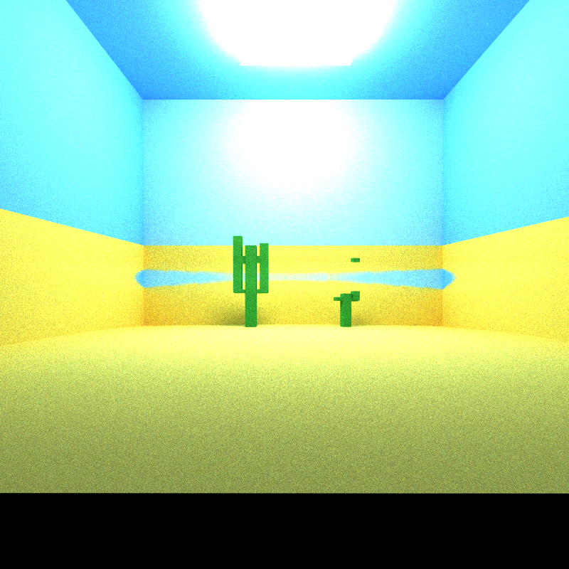

*Cover: desert / oasis scene (sand, sky, cacti) with the hot air mirage on.*

---

This is a CUDA path tracer that runs on the GPU. For every pixel it shoots a ray into the scene, bounces that ray around when it hits surfaces, and adds up many samples until the picture clears up. You can watch it refine live and press `S` to save a PNG.

On top of basic diffuse shading I added glass, depth of field, direct lighting, Russian roulette, a better random number generator, and a custom **hot-air mirage** (approved on Ed) that bends rays when they pass through hot air near the floor.

### Features

- Diffuse path tracing with multiple bounces
- Stream compaction (drop finished rays so the GPU does less work)
- Material sorting before shading (can turn on/off in the UI)
- Antialiasing by jittering each camera ray inside its pixel
- Glass with Fresnel (more reflection near grazing angles)
- Depth of field (thin lens camera)
- Direct lighting (also called next-event estimation / NEE)
- Russian roulette (stop dark rays early)
- Better RNG: 64-bit xorshift instead of the default Thrust one
- Hot air mirage (temperature → air IOR, then march and bend the ray)

---


## Hot-air mirage

In real life, hot air near the ground bends light and you get a mirage. Same idea here: there is a volume above the floor that is hotter at the bottom and cooler at the top. Hotter air has a slightly lower index of refraction. I convert temperature to IOR, estimate how IOR changes with height, and step each active ray through that volume, nudging its direction a bit every step.

`visualStrength = 1` is roughly “real world scale.” The demo images use about `200` because our room is tiny compared to a real road, so the bend would be almost invisible otherwise. The march runs before each intersection test, including after a ray bounces.


| Mirage off (`strength = 0`)       | Mirage on (`strength ≈ 200`)    |
| --------------------------------- | ------------------------------- |
| 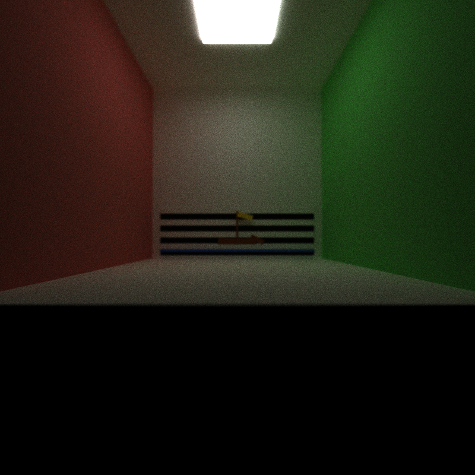 | 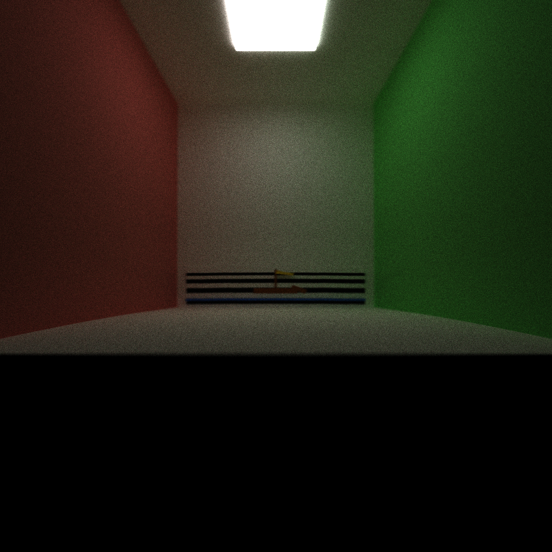 |


The horizontal stripes are there on purpose. When the mirage is on, the stripes and the ship smear vertically, because the ray that was aimed at one height on the wall actually hits a different height.

**GPU vs CPU:** every ray can march on its own, so this is a natural GPU job. On a CPU you would need a lot of threads to stay interactive.

**Performance impact:** this is one of the more expensive visual features because each ray may take up to 48 extra marching steps. I did not time the mirage separately.

**Further work:** put strength and box size in the GUI or JSON, and use smaller steps where the air changes quickly.

---


## Core path tracer

Each pixel starts one path. The path hits a surface, picks a new bounce direction, and repeats until it hits a light, flies out of the scene, or runs out of bounces. Diffuse materials bounce in a random direction biased toward the surface normal. Over many iterations the noisy image averages into a clean one.

---


## Stream compaction

After each bounce some rays are done (hit a light, escaped, or were killed). Compaction removes those dead rays from the list so the next GPU kernels only run on rays that are still alive. That saves work, especially after a few bounces.

Living path counts in **one** iteration (800×800, depth 8):

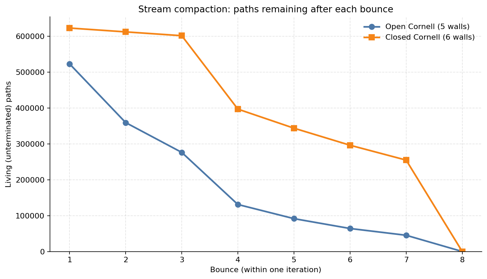


| Bounce | Open (5 walls) | Closed (6 walls) |
| ------ | -------------- | ---------------- |
| 1      | 522799         | 622719           |
| 2      | 359227         | 611990           |
| 3      | 276123         | 601399           |
| 4      | 131006         | 396802           |
| 5      | 91560          | 343652           |
| 6      | 64085          | 296143           |
| 7      | 45233          | 254723           |
| 8      | 0              | 0                |


**Open** scene = normal Cornell with no front wall (camera looks in through the missing wall). Rays escape quickly, so the living count drops fast.

**Closed** scene = same box plus a front wall, camera inside. Rays bounce around longer, so many more paths stay alive in the middle bounces. Compaction still helps, but the GPU keeps a bigger list — and FPS is lower, which matches what we measured.

**GPU vs CPU:** compacting a huge list of rays in parallel is what CUDA/Thrust is good at. A simple CPU loop can do the same idea, but it does not scale as well when you have hundreds of thousands of paths.

**Further work:** write a custom shared-memory compact (like in Project 2), or keep separate queues per ray state instead of reshuffling one big array.

---


## Material sorting

Before shading, I can sort rays by which material they hit. The hope is that nearby GPU threads all run the same shading code (all diffuse, or all glass, …) instead of mixing different materials in one group of threads.

Toggle: **Material sorting** checkbox in the ImGui window.

Measured on the current Cornell scene (800×800, depth 8, with glass / direct lighting / etc. enabled), from the ImGui FPS readout:


| Sorting | FPS |
| ------- | --- |
| Off     | ~35 |
| On      | ~20 |


Sorting **still slows things down**. Most hits are diffuse walls that all run the same shading code, even when material colors differ. Glass only covers a small part of the image, and every bounce we still pay for a full `sort_by_key` of many many paths. That sort cost is larger than any warp divergence savings we get here so far on a simple scene.

**GPU vs CPU:** this is mostly a GPU problem (groups of threads want to run the same instructions). On a CPU, sorting by material usually matters less.

**Further work:** sort by shading type (diffuse / glass / light) instead of every material ID, and only sort when many rays actually take different code paths, so it would be a smarter approach.

---


## Antialiasing

Without AA, every camera ray goes through the exact center of its pixel, so edges look jagged. With AA, each iteration I pick a random point **inside** that pixel and shoot the usual one ray from there.

It is still one camera ray per pixel per iteration, but its position changes slightly between iterations. The accumulated result makes edges smoother. The added cost is only two random numbers and a small offset per primary ray, and a CPU path tracer could use the same method.

---


## Glass / Fresnel

Glass uses Snell’s law (`glm::refract`) to bend the ray, and Schlick’s formula to randomly choose reflect vs refract (more likely to reflect when you look at the surface at a grazing angle). I put a yellow block partly behind the sphere so you can see the bend, and you can also see a bright caustic spot on the floor under the ball.


| No glass                        | Glass on                      |
| ------------------------------- | ----------------------------- |
| 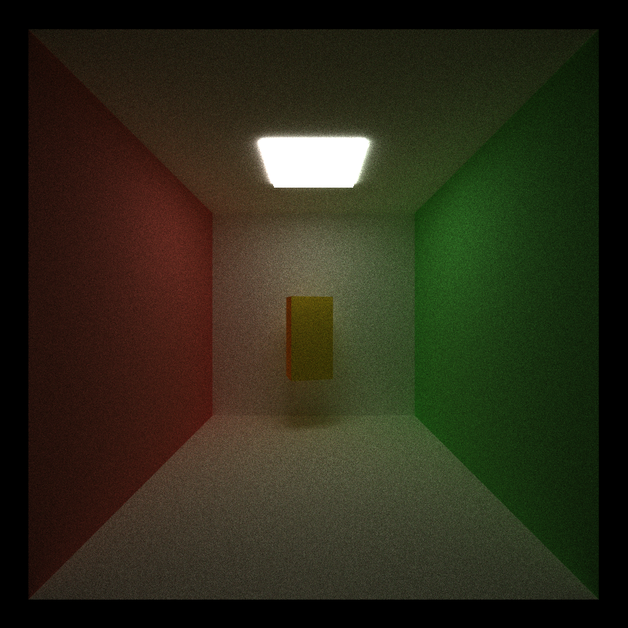 | 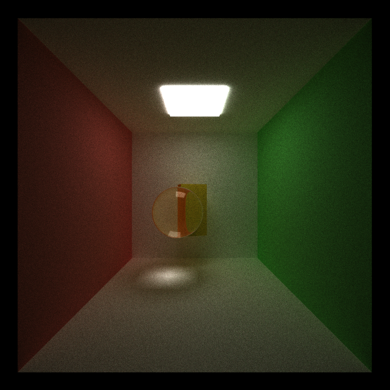 |


**GPU vs CPU:** the math is the same. On the GPU, threads run in small packs. If one thread in the pack reflects and the neighbor refracts, they take different code paths and the pack waits for both — that is the “warp divergence” cost. On a CPU you just run one ray at a time, so that packing issue does not show up the same way.

**Performance impact:** glass adds more math and branching than a diffuse bounce. I did not time it separately.

**Further work:** frosted / rough glass, glass that tints by color, and smarter sampling when trying to find lights through glass.

---


## Depth of field

Real cameras (and eyes) have a lens with size, not a perfect pinhole. I sample a random point on a small disk (`lensSize`) and aim that ray through a focus plane at `focalDistance`. Things near the focus distance stay sharp, and things closer or farther blur.

`lensSize = 0` turns it back into a pinhole (everything sharp).


| Pinhole (`lensSize = 0`)    | Thin lens (`lensSize > 0`) |
| --------------------------- | -------------------------- |
| 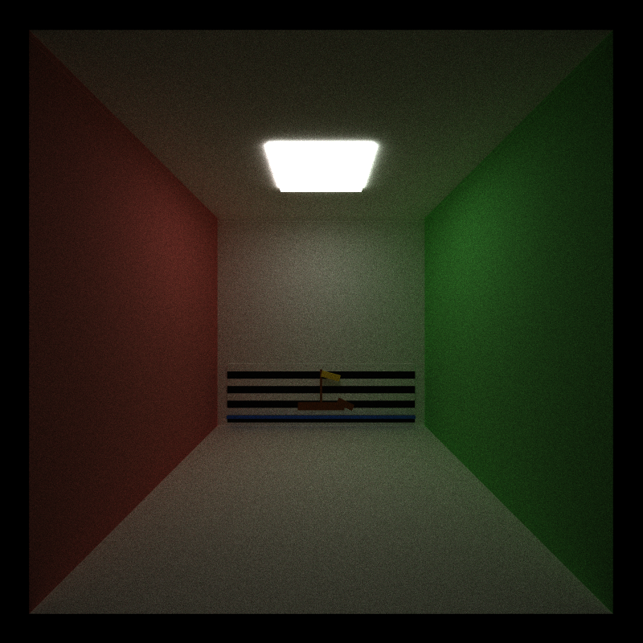 | 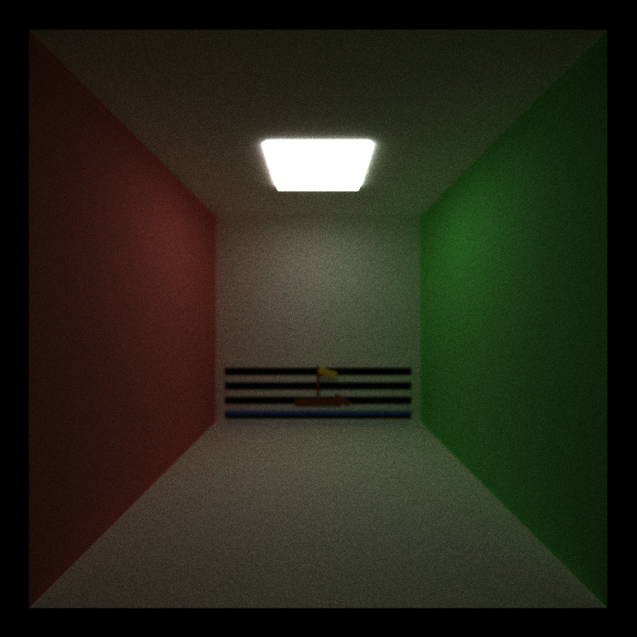  |


**GPU vs CPU:** the math per ray is tiny. The GPU wins because it does that for every pixel at once.

**Performance impact:** depth of field adds two random numbers and a few vector operations to each primary ray. I did not time it separately.

**Further work:** put focus distance and lens size in the JSON or GUI.

---


## Direct lighting (NEE)

Normal path tracing only adds light if a bounce happens to hit the lamp. That is slow to clean up. **Direct lighting** (next-event estimation) means: at a hit point, also pick a random point on the lamp, check if anything is blocking that segment (shadow ray), and if not, add that light contribution right away. Paths still bounce for indirect light (color bleeding, etc.).

The Lambert shading term includes a `/ π` factor so the energy stays in a sane range.


| Direct lighting off               | Direct lighting on              |
| --------------------------------- | ------------------------------- |
| 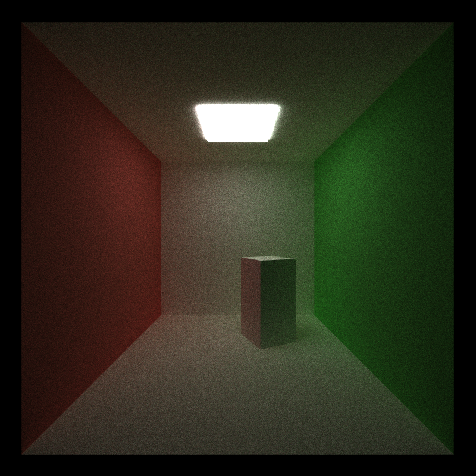 | 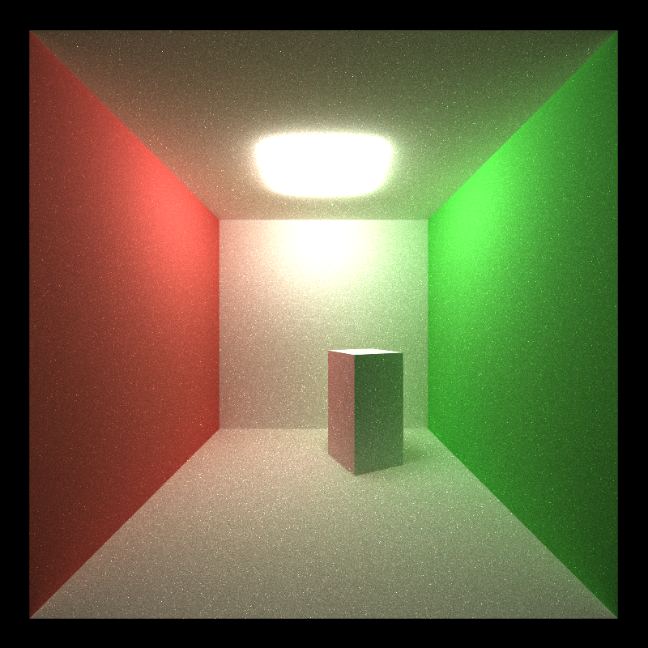 |


**Bug fix:** the shadow test treated the lamp mesh itself as a blocking obstacle, so almost every “is the light visible?” check said no. Skipping lights in that test fixed it. I also temporarily multiplied the light by 50 as a sanity check — when the room exploded to white, it was obvious the code path was finally running.

**GPU vs CPU:** lots of short shadow rays every bounce = great GPU work.

**Performance impact:** direct lighting adds a shadow ray and an occlusion check at most non-glass surface hits. It does more work per bounce, but it finds useful light paths much more reliably.

**Further work:** mix direct-light sampling and regular bounce sampling more carefully (so we do not count the lamp twice in a biased way). Also account for how the lamp face is oriented, not only the angle at the surface we hit.

---


## Russian roulette

After a path has bounced for a while, if it is already very dark, we randomly kill it (and boost the survivors so the average stays unbiased). That way we do not waste time on rays that will barely change the image.

I start this around half of the max bounce depth as a simple “it has probably lost most of its energy by now” rule. You can start it earlier or later. I also tried starting when 3/4 of the depth is left, which was a bit faster.

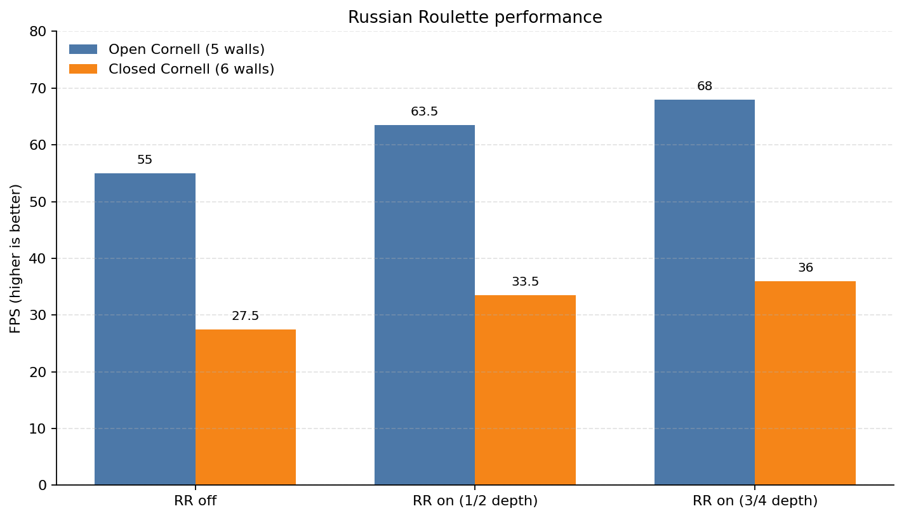


| Setting           | Open FPS | Closed FPS |
| ----------------- | -------- | ---------- |
| RR off            | 55       | 27.5       |
| RR on @ 1/2 depth | 63.5     | 33.5       |
| RR on @ 3/4 depth | 68       | 36         |


Closed scenes are slower overall (rays escape less), but Russian roulette still helps in both cases.

**GPU vs CPU:** fewer living paths → smaller GPU launches after compaction → higher FPS in the live preview.

**Further work:** decide kill chance from how bright the path still is, with simple rules instead of only bounce count.

---


## Better RNG (xorshift)

The tracer needs random numbers everywhere: pixel jitter, bounce directions, picking a point on the light, Russian roulette. I switched from the default Thrust RNG to a small 64-bit xorshift (`>> 21`, `<< 35`, `>> 4`), seeded from pixel index, iteration, and bounce depth.

Each ray needs its own repeated “dice rolls.” Xorshift produces the next roll with a few bit shifts and XOR operations, so it is small and fast.

**GPU vs CPU:** both need a fast RNG per ray. On the GPU it matters more to keep that state in fast registers.

**Performance impact:** xorshift uses only a few integer operations per random number. I did not time it against the old generator.

**Further work:** fancier low-discrepancy sequences for the first camera samples (less noise for the same sample count).

---


## Performance notes

All timings are from a **Release** Ninja build on the laptop at the top, 800×800, depth 8, reading the ImGui ms/frame and FPS after it settled.

Main takeaways:

- Compaction is real — living path counts drop every bounce, especially on the open scene.
- Russian roulette clearly improves FPS on both open and closed boxes.
- Material sorting is not free. On an all-diffuse room it can lose.
- Direct lighting changes how clean/bright the image looks more than it changes FPS.

---


## Build (Windows)

Needs CUDA Toolkit, Visual Studio 2022 C++ tools, CMake, and Ninja (the one bundled with VS is fine).

From a normal CMD:

```bat
call "C:\Program Files\Microsoft Visual Studio\2022\Community\Common7\Tools\VsDevCmd.bat" -arch=amd64 -host_arch=amd64
cd /d path\to\Project3-CUDA-Path-Tracer\build_ninja
cmake --build .
cd bin
cis565_path_tracer.exe ..\..\scenes\cornell.json
```

Without `VsDevCmd`, the build fails (`cl.exe` / `GL/glu.h` missing). I use the **Ninja** generator with `CUDA_ARCHITECTURES native` so `nvcc` runs directly (MSBuild CUDA detection hangs on this machine).

`CMakeLists.txt` changes worth knowing: CUDA include dirs are set on Windows too, and architectures are set to `native` for the laptop GPU.

Controls: `S` save image, `Esc` save and quit, mouse to orbit / zoom / move look-at.

The scene files are under `scenes/`. Some README comparisons used temporary variations of `cornell.json`, such as the closed box used for performance testing.

---


## Bloopers

- Direct lighting that did nothing until the lamp stopped counting as its own shadow obstacle — then `* 50` turned the room into a supernova.
- Mirage early-out that killed every camera ray when the camera sat above the hot-air box.
- Depth of field still on while checking glass, so everything looked blurry for the wrong reason.

---


## References

- [Physically Based Rendering, 4th ed.](https://pbr-book.org/4ed/contents) — diffuse, glass, cameras, direct lighting, Russian roulette
- [Schlick’s approximation](https://en.wikipedia.org/wiki/Schlick%27s_approximation)
- [Paul Bourke — antialiasing / stochastic sampling](https://paulbourke.net/miscellaneous/raytracing/)
- [Better random numbers for Monte Carlo (CSE 168 notes)](https://cseweb.ucsd.edu/classes/sp17/cse168-a/CSE168_07_Random.pdf)
- [Gladstone–Dale relation](https://en.wikipedia.org/wiki/Gladstone%E2%80%93Dale_relation) for air refractive index
- Hot-air / continuous-refraction approach discussed and approved on Ed Discussion

